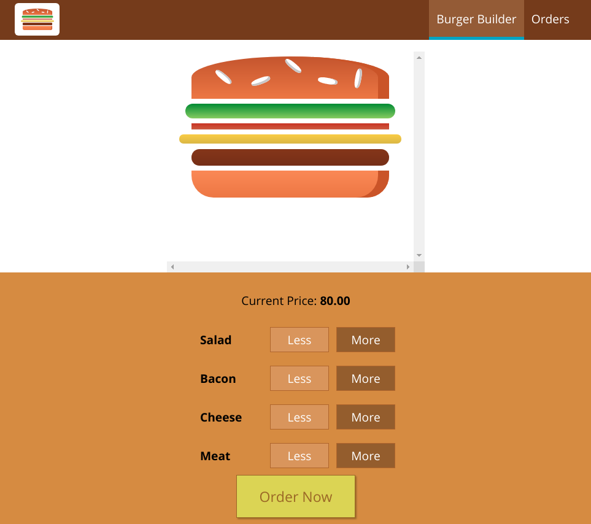
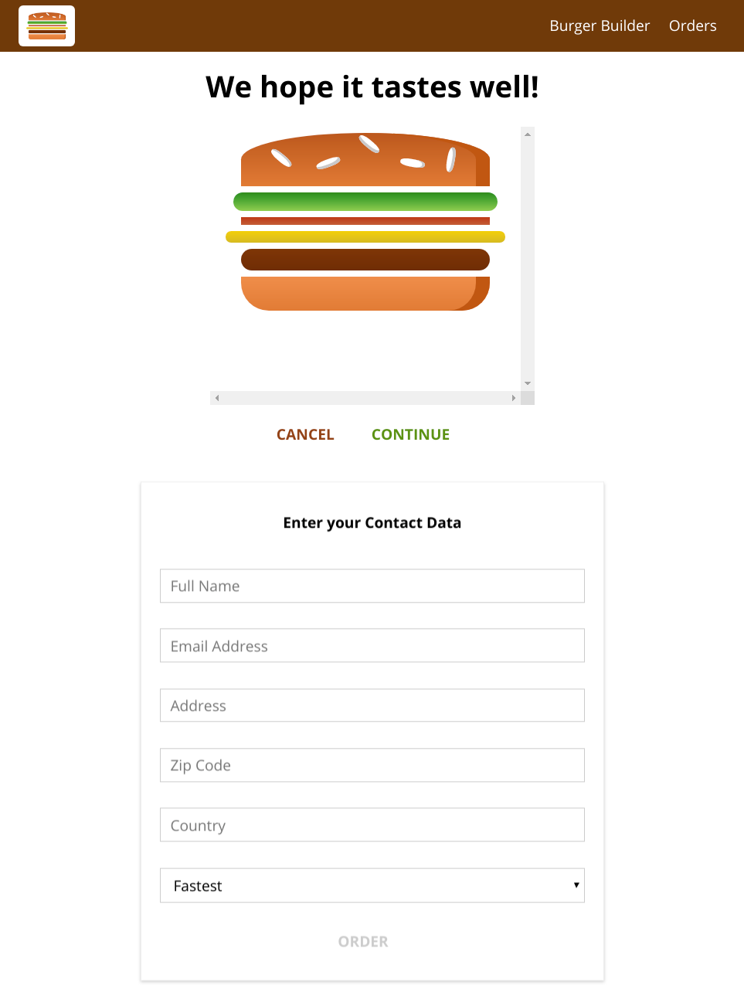
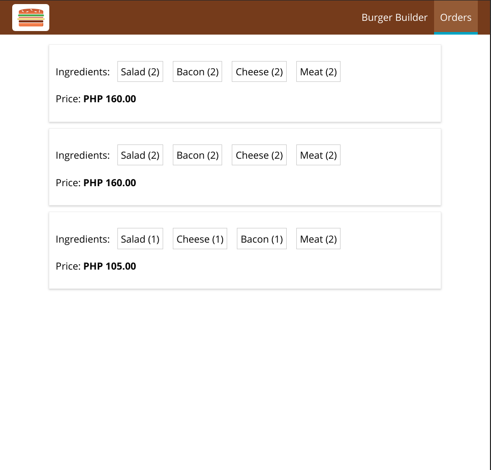

# Burger Builder App

A modified version of the tutorial project from [React - The Complete Guide](https://www.udemy.com/react-the-complete-guide-incl-redux/).







## Getting Started

### Installing

Run the command below to install node packages

```
npm install
```

or

```
yarn install
```

### Running

#### Starting React Development Server

To start the application run the command below, open a browser and go to `http://localhost:3000`

```
npm start
```

or

```
yarn start
```

#### Starting Local API Server

This project uses [json-server](https://github.com/typicode/json-server) to run a local API server.

```
npx json-server
```

`NPX` is a tool for executing Node packages without adding it to your dependencies. It comes bundled with NPM version 5.2+.
For more info check [this](https://stackoverflow.com/questions/50605219/difference-between-npx-and-npm) easy to understand stackoverflow answer.

## License

This project is licensed under the MIT License - see the [LICENSE.md](LICENSE.md) file for details.
